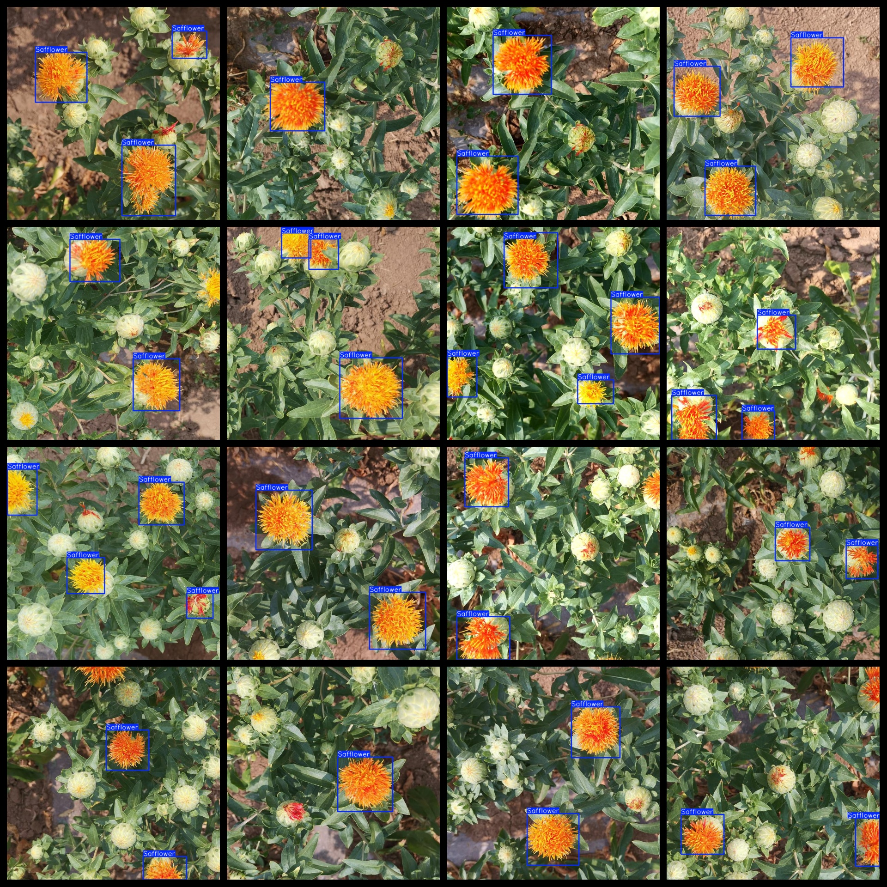
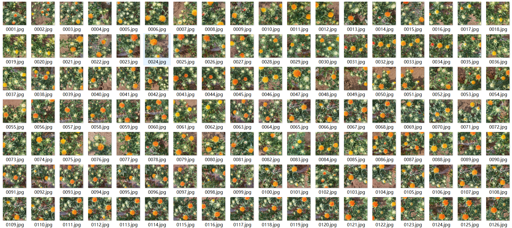

# [Object Detection] Red Flower Dataset 1437 imagesYOLO+VOC format

【Target Detection】The Honghua dataset contains 1437 images in YOLO+VOC format.

Dataset Format: VOC format + YOLO format

The compressed file contains: three folders, each storing images, xml files, and text files.

Total jpg images in JPEGImages folder: 1437

The total number of xml files in the Annotations folder is 1437.

The total number of txt files in the labels folder: 1437.

Number of tag types: 1

Tag names: ["Safflower"]

The number of boxes for each label (Note that the order of labels in the Yolo format does not correspond to this, but is based on the classes.txt file in the labels folder):

Safflower frame count = 3613

Total boxes: 3613

Picture clarity (Resolution: Pixels): Clear

Is the image enhanced: No

Shape of the label: Rectangular box, used for object detection and recognition.

Important Note: None

## Images

---

Here is a pay link on Stripe (https://buy.stripe.com/3cs8yP7sY87d0vu9AB). Please contact me lonlonago@foxmail.com after funding $89, and I will send you a complete data files, thank you!

